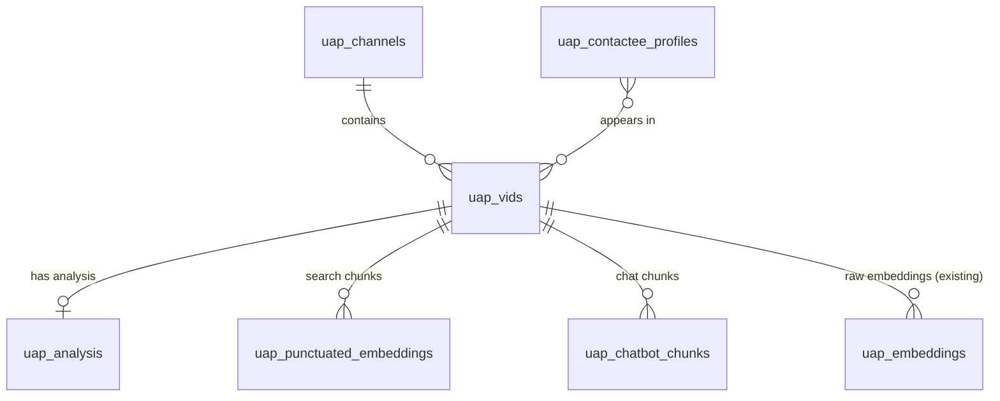

# ARCHITECTURE: UAP Vertical for Project Profound

> **Phase 2 | BMAD Methodology | Type A Development Project**
> Author: Antigravity Orchestrator | Date: 2026-05-05
> Status: ✅ APPROVED — Gate 2 passed 2026-05-05
> Source: `directives/PRD.md` (Phase 1, approved), `directives/DISCOVERY-CLAUDE.md` (Phase 0, approved)

---

## 1. Architectural Principles

1. **Additive Only** — Zero changes to NDE routes, homepage, or existing tables. All UAP work lives under `src/app/uap/` and `uap_*` tables.
2. **Parallel Tables** — `uap_vids` / `uap_analysis` / `uap_embeddings` mirror the NDE pattern. No shared schema refactor.
3. **Component Polymorphism** — Shared components accept a `domain` prop to swap colors, labels, and data sources. No forking.
4. **Pipeline Symmetry** — UAP pipelines follow the same orchestrator pattern as `intake.ts` (parse, classify, analyze, embed, complete).
5. **Constraint Compliance** — All LEARNINGS.md rules apply (server-first fetch, click-to-play, GIN RPCs, Cloud Run 300s, Cloudflare 100s async job pattern).
6. **Domain-Prefixed Naming** — Every artifact in a shared namespace (database, Actions, APIs, branches) MUST be prefixed with the domain short code. See Section 1.1.

### 1.1 Naming Convention

As the platform expands to multiple domains, consistent naming prevents collisions and makes filtering/searching trivial. The domain short code is the prefix for everything in a shared namespace.

**Domain Short Codes:**

| Domain | Short Code | Future Codes |
|--------|-----------|-------------|
| Near-Death Experiences | `nde` | — |
| UFO/UAP | `uap` | — |
| Psychedelics | `psy` | (future) |
| Out-of-Body Experiences | `obe` | (future) |
| Psi Research | `psi` | (future) |

**Convention by namespace:**

| Namespace | Pattern | NDE Example | UAP Example |
|-----------|---------|-------------|-------------|
| **Database tables** | `{code}_*` | `nde_vids`, `nde_analysis` | `uap_vids`, `uap_analysis` |
| **Database RPCs** | `*_{code}_*` | `keyword_search_videos` (legacy) | `keyword_search_uap_videos` |
| **GitHub Actions** | `{code}-*.yml` | `scanner-discover.yml` (legacy) | `uap-scanner-discover.yml` |
| **Action display name** | `[UAP] Description` | `Channel Discovery (Hourly)` (legacy) | `[UAP] Channel Discovery (Hourly)` |
| **API routes** | `/api/.../{code}/...` | `/api/scanner/discover` (legacy) | `/api/scanner/uap/discover` |
| **Cron API routes** | `/api/cron/{code}/*` | `/api/cron/blog-questions` (legacy) | `/api/cron/uap/blog-questions` |
| **Admin routes** | `/admin/{code}/*` | `/admin/` (legacy, root) | `/admin/uap/` |
| **Public routes** | `/{code}/*` | `/` (legacy, root) | `/uap/` |
| **Source files** | `src/lib/ai/{code}-*` | `classify-experience.ts` (legacy) | `classify-uap.ts` |
| **Pipeline files** | `src/lib/pipeline/{code}-*` | `intake.ts` (legacy) | `uap-intake.ts` |
| **Components** | `src/components/{code}/` | `src/components/video/` (legacy) | `src/components/uap/` |
| **CSS variables** | `--{code}-*` | `--nde-accent` (future) | `--uap-accent` |
| **Git branches** | `{code}/*` | `nde/fix-search` | `uap/sprint-1-foundation` |
| **Config keys** | `domain: '{code}'` | `domain: 'nde'` | `domain: 'uap'` |

> **Note on legacy NDE naming:** Existing NDE artifacts (tables, Actions, routes) do NOT
> get renamed to add the `nde-` prefix. They keep their current names. Only new domains
> get the prefix. When the hub phase arrives and NDE moves to `/nde/`, we'll add redirects
> but the database tables and Actions keep their original names.

---

## 2. Tech Stack (Unchanged)

| Layer | Technology | Notes |
|-------|-----------|-------|
| Frontend | Next.js 14+ (App Router) | New routes under `src/app/uap/` |
| Styling | Tailwind CSS + CSS Variables | Domain accent via layout.tsx CSS vars |
| UI | Shadcn + custom components | Polymorphic via `domain` prop |
| Database | Supabase (PostgreSQL + pgvector) | Parallel `uap_*` tables |
| Auth | Supabase Auth | Unchanged, same session |
| AI/LLM | OpenAI (embeddings), Gemini/Claude (analysis) | Domain-specific prompts |
| Search | Supabase RPCs (GIN + HNSW) | New RPCs for UAP tables |
| Hosting | Firebase App Hosting (Cloud Run) | Same deployment |

---

## 3. Database Schema

### 3.1 Migrations

All migrations in `supabase/migrations/` with timestamped filenames.

#### Migration 1: `uap_analysis` table

```sql
CREATE TABLE uap_analysis (
  video_id TEXT PRIMARY KEY REFERENCES uap_vids(video_id),
  -- NOTE: content_type, tier, and track live in uap_vids ONLY (single source of truth).
  -- This table stores analysis OUTPUT. JOIN to uap_vids for classification data.

  -- Triad Axis 1: Evidence (Tier 1 only, UAP-ESS 0-28)
  evidence_score SMALLINT,
  evidence_breakdown JSONB,

  -- Triad Axis 2: Experience (Tier 1 only)
  hynek_type TEXT,                     -- CE1, CE2, CE3, CE4, CE5, NL, DD
  vallee_type TEXT,                    -- AN1-5, MA1-5, FB1-3
  contact_depth_score SMALLINT,        -- 0-28
  contact_depth_breakdown JSONB,

  -- Triad Axis 3: Impact (same NDE-TI, 0-50)
  transformation_score INTEGER,
  transformation_breakdown JSONB,

  -- Phenomenological dimensions (Tier 1)
  experience_type TEXT,
  phenomenology JSONB,
  entities JSONB,
  overall_tone TEXT,
  physical_effects JSONB,
  technology_described JSONB,
  message_content JSONB,
  recurrence_pattern TEXT,             -- one-time, periodic, ongoing
  witness_count INTEGER,
  evidence_types TEXT[],               -- photo, video, radar, physical_trace

  -- Track 2 fields (Tier 2 program/disclosure)
  people_mentioned JSONB,
  programs_mentioned JSONB,
  claims JSONB,
  consciousness_connections JSONB,
  timeline_events JSONB,

  -- Safety + fingerprint
  content_safety JSONB,
  experience_fingerprint vector(1536),

  created_at TIMESTAMPTZ DEFAULT now(),
  updated_at TIMESTAMPTZ DEFAULT now()
);

CREATE INDEX idx_uap_analysis_hynek ON uap_analysis(hynek_type);
CREATE INDEX idx_uap_analysis_evidence ON uap_analysis(evidence_score);
CREATE INDEX idx_uap_analysis_transformation ON uap_analysis(transformation_score);
```

#### Migration 2: `uap_channels` table

```sql
CREATE TABLE uap_channels (
  channel_id TEXT PRIMARY KEY,
  channel_name TEXT NOT NULL,
  track TEXT NOT NULL DEFAULT 'mixed',  -- encounters, program, mixed
  description TEXT,
  avatar_url TEXT,
  banner_url TEXT,
  custom_url TEXT,
  subscriber_count BIGINT,
  total_video_count BIGINT,
  total_view_count BIGINT,
  video_count INTEGER DEFAULT 0,       -- UAP videos we have
  hidden BOOLEAN DEFAULT false,
  published_at TIMESTAMPTZ,
  fetched_at TIMESTAMPTZ,
  created_at TIMESTAMPTZ DEFAULT now()
);
```

#### Migration 3: `uap_contactee_profiles` table

```sql
CREATE TABLE uap_contactee_profiles (
  id UUID PRIMARY KEY DEFAULT gen_random_uuid(),
  slug TEXT UNIQUE NOT NULL,
  display_name TEXT NOT NULL,
  is_anonymous BOOLEAN DEFAULT false,
  summary TEXT,
  bio TEXT,
  photo_url TEXT,
  video_ids TEXT[] NOT NULL DEFAULT '{}',
  channel_ids TEXT[] DEFAULT '{}',
  experience_type TEXT,                -- contact, abduction, CE-5, ongoing, mixed
  entity_types TEXT[] DEFAULT '{}',
  recurrence TEXT,                     -- one-time, periodic, ongoing
  core_themes TEXT[] DEFAULT '{}',
  avg_evidence_score NUMERIC(5,2),
  avg_contact_depth NUMERIC(5,2),
  avg_transformation_score NUMERIC(5,2),
  social_links JSONB DEFAULT '{}',
  published_at TIMESTAMPTZ,
  created_at TIMESTAMPTZ DEFAULT now(),
  updated_at TIMESTAMPTZ DEFAULT now()
);

CREATE INDEX idx_uap_contactee_slug ON uap_contactee_profiles(slug);
```

#### Migration 4: `uap_vids` column additions

```sql
ALTER TABLE uap_vids
  ADD COLUMN IF NOT EXISTS content_type TEXT,
  ADD COLUMN IF NOT EXISTS tier SMALLINT DEFAULT 2,
  ADD COLUMN IF NOT EXISTS track TEXT DEFAULT 'program',
  ADD COLUMN IF NOT EXISTS subtitles_punctuated TEXT,
  ADD COLUMN IF NOT EXISTS subtitles_cleaned TEXT,
  ADD COLUMN IF NOT EXISTS experiencer_name TEXT,
  ADD COLUMN IF NOT EXISTS intake_status TEXT DEFAULT 'pending',
  ADD COLUMN IF NOT EXISTS analysis_uap_summary TEXT;
```

#### Migration 5: `uap_punctuated_embeddings` table

The existing `uap_embeddings` table has raw (unpunctuated) embeddings. We need a punctuated version for timestamped search, mirroring `nde_punctuated_embeddings`.

```sql
CREATE TABLE uap_punctuated_embeddings (
  id BIGSERIAL PRIMARY KEY,
  video_id TEXT REFERENCES uap_vids(video_id),
  content TEXT,
  embedding vector(1536),
  start_time REAL,
  created_at TIMESTAMPTZ DEFAULT now()
);

CREATE INDEX idx_uap_punct_embed_video ON uap_punctuated_embeddings(video_id);
CREATE INDEX idx_uap_punct_embed_vec ON uap_punctuated_embeddings
  USING hnsw (embedding vector_cosine_ops) WITH (m = 16, ef_construction = 64);
```

#### Migration 6: `uap_chatbot_chunks` table

```sql
CREATE TABLE uap_chatbot_chunks (
  id BIGSERIAL PRIMARY KEY,
  video_id TEXT REFERENCES uap_vids(video_id),
  content TEXT,
  embedding vector(1536),
  metadata JSONB,
  created_at TIMESTAMPTZ DEFAULT now()
);

CREATE INDEX idx_uap_chatbot_video ON uap_chatbot_chunks(video_id);
CREATE INDEX idx_uap_chatbot_vec ON uap_chatbot_chunks
  USING hnsw (embedding vector_cosine_ops) WITH (m = 16, ef_construction = 64);
```

#### Migration 7: Search RPCs

> **⚠️ TIER 3 GUARD:** All keyword search RPCs that query `uap_vids` directly MUST
> include `WHERE v.tier != 3` (or `WHERE v.intake_status != 'out_of_scope'`) to
> prevent out-of-scope content (cryptids, ghost hunting) from leaking into search
> results. Semantic search is naturally guarded because Tier 3 videos never get
> punctuated embeddings, but keyword search is NOT.

```sql
-- Keyword search for UAP videos (PL/pgSQL for GIN index per LEARNINGS.md)
-- MUST include WHERE tier != 3 to exclude out-of-scope content
CREATE OR REPLACE FUNCTION keyword_search_uap_videos(
  search_query TEXT,
  sort_column TEXT DEFAULT 'relevance',
  sort_direction TEXT DEFAULT 'DESC',
  page_limit INT DEFAULT 12,
  page_offset INT DEFAULT 0,
  filter_tier SMALLINT DEFAULT NULL,
  filter_track TEXT DEFAULT NULL,
  filter_channel_name TEXT[] DEFAULT NULL,
  filter_hynek_type TEXT[] DEFAULT NULL
) RETURNS TABLE(...) AS $$
-- PL/pgSQL with IF/ELSE branching (same pattern as keyword_search_videos)
-- CRITICAL: All branches MUST include "AND v.tier != 3" in WHERE clause
$$ LANGUAGE plpgsql STABLE;

-- Semantic search across UAP punctuated embeddings
-- Tier 3 guard is implicit: Tier 3 videos never get punctuated embeddings
CREATE OR REPLACE FUNCTION search_uap_punctuated_embeddings(
  query_embedding vector(1536),
  similarity_threshold FLOAT DEFAULT 0.50,
  page_limit INT DEFAULT 12,
  page_offset INT DEFAULT 0,
  filter_tier SMALLINT DEFAULT NULL,
  filter_track TEXT DEFAULT NULL
) RETURNS TABLE(...) AS $$
-- Same pattern as search_punctuated_embeddings_filtered
$$ LANGUAGE plpgsql STABLE;

-- UAP channel stats (mirrors get_channel_stats)
CREATE OR REPLACE FUNCTION get_uap_channel_stats()
RETURNS TABLE(...) AS $$
$$ LANGUAGE plpgsql STABLE;

-- UAP facets (excludes Tier 3)
CREATE OR REPLACE FUNCTION uap_search_facets()
RETURNS JSONB AS $$
$$ LANGUAGE plpgsql STABLE;
```

### 3.2 RLS Policies

```sql
-- uap_analysis: public read, service_role write
ALTER TABLE uap_analysis ENABLE ROW LEVEL SECURITY;
CREATE POLICY "Public read" ON uap_analysis FOR SELECT USING (true);
CREATE POLICY "Service write" ON uap_analysis FOR ALL USING (auth.role() = 'service_role');

-- Same pattern for uap_channels, uap_contactee_profiles,
-- uap_punctuated_embeddings, uap_chatbot_chunks
```

### 3.3 ER Diagram



---

## 4. Pipeline Architecture

### 4.1 Pipeline Overview

```
┌─────────────────────────────────────────────────────────────┐
│               UAP Pipeline Orchestrator                     │
│                  (uap-intake.ts)                             │
├──────────┬─────────┬──────────┬───────────┬────────────────┤
│ Step 1   │ GATE    │ Step 2   │ Step 3    │ Step 4         │
│ Classify │ Tier 3? │ Punctuate│ Analyze   │ Embed          │
│ (all)    │ → STOP  │ (T1+T2)  │ (by tier) │ (T1+T2)        │
└──────────┴─────────┴──────────┴───────────┴────────────────┘
```

**Critical gate:** After classification, Tier 3 (out_of_scope) videos are marked
`intake_status = 'out_of_scope'` and **skip all downstream steps** (no punctuation,
no analysis, no embedding). The row remains in `uap_vids` so it is never re-processed.

### 4.2 Content Classifier (`src/lib/ai/classify-uap.ts`)

Mirrors `classify-experience.ts` pattern. Runs on first 2000 chars of title + description + transcript.

```typescript
export interface UapClassificationResult {
  content_type: 'first_person' | 'retold_story' | 'research_analysis' | 'program_disclosure' | 'out_of_scope';
  tier: 1 | 2 | 3;
  track: 'encounters' | 'program';
  confidence: number;        // 0-100
  justification: string;
  experiencer_name: string | null;  // Tier 1 only
}
```

**Key design decisions:**
- Uses `gpt-4o-mini` with `response_format: { type: 'json_object' }` (same as NDE classifier)
- Truncates to 2000 chars (cheaper than NDE's 15000, sufficient for classification)
- Channel name is a strong signal (e.g., "Mantis Encounters" = likely Tier 1)
- Batch-processable: script iterates all 4,195 `uap_vids` rows

### 4.3 Punctuation Pipeline (`src/lib/pipeline/uap-punctuate.ts`)

Reuses existing punctuation logic from NDE pipeline. **Only runs on Tier 1 and Tier 2 videos** (skips Tier 3). Reads `uap_vids.raw_timestamped_subtitles`, outputs punctuated text.

**Flow:** Check `tier != 3` -> `raw_timestamped_subtitles` -> GPT punctuation -> write `subtitles_punctuated` + `subtitles_cleaned` -> update `timestamped_punctuation_status = 'complete'`

### 4.4 Triad Analysis Pipeline (`src/lib/ai/uap-triad/`)

Tier 1 only. Three parallel analysis passes:

```
src/lib/ai/uap-triad/
  evidence.ts        # UAP-ESS (0-28), adapted from Vallee SVP
  contact-depth.ts   # Contact Depth Scale (0-28) + Hynek/Vallee classification
  transformation.ts  # Reuses existing NDE-TI (0-50) - same scale, validated by FREE
```

Each file exports a function matching the NDE pattern:
```typescript
export async function analyzeUapEvidence(transcript: string): Promise<UapEvidenceResult | null>
```

> **⚠️ LEARNINGS.md: Claude JSON Forcing.** The Triad analysis uses Claude for
> qualitative scoring. You MUST use Assistant Prefill (`{ role: 'assistant', content: '{' }`)
> when calling the Anthropic API. System prompts alone will NOT reliably produce JSON.
> Failure to do this will cause intermittent JSON parse failures in the pipeline.

**UAP-ESS (Evidence Strength Scale):** The scoring rubric will be developed in a dedicated research session and documented in `docs/scales/UAP-ESS.md` before Sprint 2 begins. It adapts the Vallee SVP credibility framework into a 0-28 numerical scale with sub-dimensions for: witness credibility, physical evidence, multi-witness corroboration, sensor data, and documentation quality.

### 4.5 Knowledge Extraction Pipeline (`src/lib/ai/uap-knowledge.ts`)

Tier 2 only. Single LLM call extracting structured data:

```typescript
export interface KnowledgeExtractionResult {
  people_mentioned: Array<{ name: string; role: string; context: string }>;
  programs_mentioned: Array<{ name: string; era: string; description: string }>;
  claims: Array<{ claim: string; source: string; evidence_level: 'confirmed' | 'claimed' | 'speculative' }>;
  consciousness_connections: Array<{ topic: string; quote: string; bridge_to: 'encounters' | 'nde' | 'psi' }>;
  timeline_events: Array<{ date: string; event: string; source_video_id: string }>;
}
```

> **⚠️ LEARNINGS.md: Zod Strips Unknown Properties.** Every property in the
> TypeScript interfaces above MUST have a matching field in the corresponding Zod
> schema. Zod's `.safeParse()` silently drops any properties not in the schema.
> Ensure perfect parity between the TS interface and Zod schema, or analysis data
> will be silently lost with zero compile errors.

### 4.6 UAP Intake Orchestrator (`src/lib/pipeline/uap-intake.ts`)

Mirrors `intake.ts` structure. Steps:

1. Parse video_id
2. Check if already processed (skip if `intake_status` is `complete` or `out_of_scope`)
3. Read existing metadata from `uap_vids` (already populated)
4. Classify content (Step 4.2)
5. **GATE: if Tier 3, mark `intake_status = 'out_of_scope'` and STOP** (no punctuation, no analysis, no embedding)
6. Punctuate transcript (Step 4.3) — Tier 1+2 only
7. If Tier 1: Run Triad Analysis (Step 4.4) in parallel
8. If Tier 2: Run Knowledge Extraction (Step 4.5)
9. Generate punctuated embeddings (into `uap_punctuated_embeddings`)
10. Generate chat chunks (into `uap_chatbot_chunks`)
11. If Tier 1 + experiencer detected: sync contactee profile
12. Mark `intake_status = 'complete'`

**Key:** The Tier 3 gate at step 5 saves ~$0.01-0.05 per video in punctuation + embedding costs. For an estimated 500-1000 out-of-scope videos, this saves $5-50. The video remains in `uap_vids` with `intake_status = 'out_of_scope'` so batch scripts never re-process it.

**Constraint:** Respects Cloud Run 300s limit. For batch processing, use the async job pattern (POST queues job, browser polls status).

### 4.7 Batch Processing Scripts

```
scripts/uap-batch-classify.ts   # Classifies all 4,195 videos (WHERE intake_status = 'pending')
scripts/uap-batch-punctuate.ts  # Punctuates Tier 1+2 only (WHERE tier IN (1,2) AND punctuation_status IS NULL)
scripts/uap-batch-analyze.ts    # Runs Triad/KE on classified videos (WHERE tier = 1 or 2 AND analysis IS NULL)
```

Each script processes N videos per invocation, tracks progress via `intake_status` column. Tier 3 videos are automatically excluded by the WHERE clause.

---

## 5. Component Architecture

### 5.1 Domain Config Pattern

Central config that all polymorphic components consume:

```typescript
// src/lib/config/domains.ts

export type Domain = 'nde' | 'uap';
export type UapTrack = 'encounters' | 'program';

export interface DomainConfig {
  domain: Domain;
  label: string;
  accentColor: string;        // Tailwind class prefix
  chatSystemPrompt: string;
  embeddingTable: string;
  videoTable: string;
  analysisTable: string;
  searchRpc: string;
  semanticSearchRpc: string;
}

export const DOMAIN_CONFIGS: Record<Domain, DomainConfig> = {
  nde: {
    domain: 'nde',
    label: 'Near-Death Experiences',
    accentColor: 'blue',
    chatSystemPrompt: '...compassionate NDE guide...',
    embeddingTable: 'nde_punctuated_embeddings',
    videoTable: 'nde_vids',
    analysisTable: 'nde_analysis',
    searchRpc: 'keyword_search_videos',
    semanticSearchRpc: 'search_punctuated_embeddings_filtered',
  },
  uap: {
    domain: 'uap',
    label: 'UFO & UAP',
    accentColor: 'violet',
    chatSystemPrompt: '...curious UAP researcher...',
    embeddingTable: 'uap_punctuated_embeddings',
    videoTable: 'uap_vids',
    analysisTable: 'uap_analysis',
    searchRpc: 'keyword_search_uap_videos',
    semanticSearchRpc: 'search_uap_punctuated_embeddings',
  },
};
```

### 5.2 Shared Components (Polymorphic)

These existing components gain an optional `domain` prop:

| Component | File | Change |
|-----------|------|--------|
| `<YouTubePlayer>` | `src/components/video/` | None |
| `<TimestampLink>` | `src/components/video/` | None |
| `<SocialShareButton>` | `src/components/video/` | None |
| `<MicroFeedback>` | `src/components/` | Add `feature` variants for UAP |
| Video card | New shared | Accept `domain` + `videoRoute` |
| Search results | New shared | Accept `domain` for tier labels |

### 5.3 New UAP Components

```
src/components/uap/
  triad-scores-panel.tsx       # Evidence + Experience + Impact breakdown cards
  hynek-badge.tsx              # CE1-CE5 classification badge
  vallee-badge.tsx             # AN/MA/FB classification badge
  uap-radar-chart.tsx          # 5-axis radar (Transformation, Intensity, etc.)
  knowledge-panel.tsx          # People, programs, claims, timeline for Track 2
  content-safety-banner.tsx    # Warning banner for flagged content
  consciousness-bridge.tsx     # Callout linking Track 2 -> Track 1
  timeline-event.tsx           # Single event in disclosure timeline
  contactee-card.tsx           # Profile card for contactee listing
  tier-badge.tsx               # "First-Person" / "Research" label
```

### 5.4 UAP Layout

```typescript
// src/app/uap/layout.tsx

export default function UapLayout({ children }: { children: React.ReactNode }) {
  return (
    <div className="uap-domain" style={{
      '--domain-accent': 'var(--violet-600)',
      '--domain-accent-light': 'var(--violet-50)',
    } as React.CSSProperties}>
      {/* UAP-specific nav breadcrumb */}
      <DomainBreadcrumb domain="uap" />
      {children}
    </div>
  );
}
```

---

## 6. API Architecture

### 6.1 Search API (`src/app/api/uap/search/route.ts`)

Mirrors `/api/search3/route.ts`. Accepts same payload shape, calls UAP-specific RPCs.

```typescript
// Key differences from NDE search:
// 1. Calls keyword_search_uap_videos / search_uap_punctuated_embeddings
// 2. Adds tier and track to filter params
// 3. Returns tier/track metadata in hit documents
// 4. Calls uap_search_facets() for UAP-specific facets (hynek_type, track, etc.)
```

### 6.2 Chat API (`src/app/api/uap/chat/route.ts`)

Server action pattern (same as `getChatResponse` in `actions.ts`):

```typescript
// src/app/uap/actions.ts
'use server';

export async function getUapChatResponse(question: string) {
  // 1. Generate embedding for question
  // 2. Query uap_chatbot_chunks via vector similarity
  // 3. Build context from top-k chunks
  // 4. Call LLM with UAP system prompt + context + question
  // 5. Return answer with video citations (video_id + start_time)
}
```

**System prompt tone:** "Curious UAP researcher" (not NDE's "compassionate guide"). Includes:
- Do not confirm/deny reality of experiences
- Cite specific videos with timestamps
- Flag distressing content with care resources
- Do not diagnose or pathologize experiencers
- Maintain editorial boundary (consciousness experiences only)

### 6.3 Admin APIs

```
src/app/api/admin/uap/
  classify/route.ts            # Trigger batch classification
  punctuate/route.ts           # Trigger batch punctuation
  analyze/route.ts             # Trigger Triad/KE analysis
  status/route.ts              # Pipeline progress dashboard
  channels/route.ts            # UAP channel management
```

All admin routes use `isAdminUser()` guard (per LEARNINGS.md).

---

## 7. Route Architecture

### 7.1 Public Routes

```
src/app/uap/
  page.tsx                     # Landing page (RSC)
  layout.tsx                   # Domain layout + CSS vars

  encounters/
    page.tsx                   # Browse Tier 1 (RSC, paginated)
    video/[id]/page.tsx        # Encounter detail (RSC + generateStaticParams)

  program/
    page.tsx                   # Browse Tier 2 (RSC, paginated)
    video/[id]/page.tsx        # Program detail (RSC + generateStaticParams)
    person/[name]/page.tsx     # Knowledge graph person (RSC)
    timeline/page.tsx          # Disclosure timeline (RSC)

  channels/page.tsx            # UAP channel list (RSC)
  channel/[id]/page.tsx        # Channel detail (RSC)

  chat/page.tsx                # UAP chat (Client Component, uses server action)

  search/page.tsx              # UAP search (Client Component)

  questions/[slug]/page.tsx    # UAP Big Questions (RSC)
  blog/[slug]/page.tsx         # UAP blog posts (RSC)

  contactee/[slug]/page.tsx    # Contactee profile (RSC + generateStaticParams)
```

> **⚠️ LEARNINGS.md: generateStaticParams Trap.** All routes using `generateStaticParams`
> and `generateMetadata` MUST use the anon/service client, NOT `createClient()` from
> `@/lib/supabase/server`. The server client calls `cookies()` which throws outside
> request scopes, crashing the production static build. Use `buildClient()` (anon key).
```

### 7.2 Admin Routes (Centralized at `/admin/uap/`)

The admin panel stays centralized at `/admin/`. UAP management is added as a new nav group in the existing sidebar, NOT a separate admin panel.

```
src/app/admin/uap/
  page.tsx                     # UAP dashboard (pipeline stats, classification breakdown)
  intake/page.tsx              # UAP video intake (trigger classify/punctuate/analyze)
  channels/page.tsx            # UAP channel management (track assignment, hide/show)
  contactees/page.tsx          # Contactee profile editor
  classifier/page.tsx          # Review/override Tier assignments
```

**Admin sidebar addition:** A new "UAP" nav group in `admin/layout.tsx` with violet accent, containing links to the pages above. Same auth guard, same layout.

### 7.3 User Dashboard (Unified)

The existing `/dashboard` page stays unified across domains. Collections and saved searches gain domain awareness:

- `favorites` table: Add `domain TEXT DEFAULT 'nde'` column. Favorites from UAP videos get `domain = 'uap'`.
- `saved_searches` table: Add `domain TEXT DEFAULT 'nde'` column.
- `collections` table: No change needed (collections can mix domains).
- Dashboard UI: Group favorites by domain with tabs or domain badges. Links route to correct video path (`/video/[id]` for NDE, `/uap/encounters/video/[id]` or `/uap/program/video/[id]` for UAP).

**Data fetching pattern:** All page-level data fetched in RSC using `buildClient()` (anon key, SSG-safe). Same pattern as existing `experiencer/[slug]/page.tsx`.

---

## 8. Security Model

| Concern | Approach |
|---------|----------|
| Admin routes | `isAdminUser()` guard on all `/api/admin/uap/*` |
| RLS | Public read on all UAP tables, service_role write |
| Service key | Server-side only via `SUPABASE_SERVICE_KEY` env var |
| Content safety | JSONB flags in `uap_analysis`, rendered as warning banners |
| Anonymous profiles | `is_anonymous` flag on `uap_contactee_profiles` |
| Chat safety | System prompt constraints, no diagnosis, crisis resources |
| Claims labeling | Track 2 claims show evidence_level (confirmed/claimed/speculative) |

---

## 9. 3rd Party Integrations

| Service | Purpose | Cost Impact |
|---------|---------|-------------|
| OpenAI | Embeddings (text-embedding-3-small) | ~$2-5 for re-embedding 4K videos |
| OpenAI/Claude | Classification + Analysis | ~$20-50 for full pipeline run |
| Supabase | Database + pgvector | +~5GB storage (~$0.63/mo overage) |
| Tavily | Blog research | Existing free tier |
| YouTube Data API | Channel metadata enrichment | Existing quota |

---

## 10. Deployment Strategy

### Phase 4 Build Order (Sprint Sequence)

```
Sprint 1: Foundation
  - Database migrations (all 7 + favorites/saved_searches domain column)
  - Domain config system
  - UAP layout + landing page
  - Content classifier pipeline (with Tier 3 gate)
  - Batch classify all 4,195 videos
  - Admin sidebar: add UAP nav group
  - Admin UAP dashboard (pipeline stats)

Sprint 2: Pipeline
  - Develop UAP-ESS scoring rubric (docs/scales/UAP-ESS.md)
  - Punctuation pipeline (batch Tier 1+2 only, skip Tier 3)
  - Punctuated embeddings generation (Tier 1+2)
  - Chat chunks generation (Tier 1+2)
  - Triad analysis pipeline (Tier 1)
  - Knowledge extraction pipeline (Tier 2)
  - Admin classifier review page

Sprint 3: Core Pages
  - Video detail pages (encounters + program)
  - Triad scores panel + radar chart
  - Knowledge panel (Track 2)
  - Channel list + detail pages
  - Search page + API
  - Admin channel management page

Sprint 4: Profiles & Discovery
  - Contactee profiles
  - Person pages (knowledge graph)
  - Disclosure timeline
  - Chat page + server action
  - Content safety banners
  - Admin contactee editor

Sprint 5: Content & Polish
  - UAP Big Questions (5-10 seed)
  - UAP Blog posts (3-5 launch)
  - Dashboard: domain-aware collections + saved searches
  - SEO (generateMetadata, JSON-LD, sitemap)
  - NDE regression testing
  - Launch gate checklist
```

### Deployment

Same Firebase App Hosting pipeline. No infrastructure changes. UAP routes deploy alongside NDE routes in the same Next.js build.

**Environment variables:** No new env vars required. All pipelines use existing `OPENAI_API_KEY`, `SUPABASE_SERVICE_KEY`, and `TAVILY_API_KEY`.

### 10.1 GitHub Actions (Automated Pipelines)

The UAP vertical needs equivalent cron-based automation to the NDE pipeline. All Actions follow the same pattern: `curl` to API route with `CRON_SECRET` auth via `APP_DIRECT_URL` (bypasses Cloudflare). No new secrets required.

| Action File | NDE Equivalent | Schedule | What It Does |
|-------------|---------------|----------|-------------|
| `uap-scanner-discover.yml` | `scanner-discover.yml` | Hourly | Scan 1 UAP channel for new videos, queue for intake |
| `uap-scanner-process.yml` | `scanner-process.yml` | Every 10 min | Process 1 queued UAP video (classify + gate + punctuate + analyze + embed) |
| `uap-blog-questions.yml` | `blog-generate-questions.yml` | Daily | Generate 1 UAP Big Question blog post |
| `uap-blog-stories.yml` | `blog-generate-stories.yml` | Daily | Generate 1 UAP story-format blog post |
| `uap-triad-cron.yml` | `greyson-cron.yml` etc. | Daily | Batch Triad analysis on unanalyzed Tier 1 videos |
| `uap-knowledge-cron.yml` | (new) | Daily | Batch knowledge extraction on unanalyzed Tier 2 videos |

**API routes these Actions hit:**

```
POST /api/scanner/uap/discover    # Scan next UAP channel
POST /api/scanner/uap/process     # Process next queued UAP video
POST /api/cron/uap/blog-questions # Generate UAP blog post
POST /api/cron/uap/triad          # Batch Triad analysis
POST /api/cron/uap/knowledge      # Batch knowledge extraction
```

**Key difference from NDE:** The UAP processor includes the Tier 3 gate. New videos from channel scans get classified first; if Tier 3, they're marked `out_of_scope` and the pipeline stops before punctuation. This means the 10-min cron may complete in seconds for clickbait videos.

**Specific schedules and batch sizes will be defined in Sprint Planning (Phase 3).** The architecture just defines the API contracts and the Actions that will call them.

### 10.2 Oracle Cloud Always-On Worker (UAP Processing Server)

> **Added 2026-05-25.** The UAP pipeline has a dedicated always-on worker running on Oracle Cloud Free Tier, providing ~40-80 videos/hour throughput 24/7 at $0/month cost.

#### Architecture

```
┌──────────────────────────────────────────────────┐
│  Oracle Cloud VM (Always Free, Ubuntu 22.04)     │
│  Host: profound-worker                           │
│  IP: 150.230.166.48                              │
│  Region: US East (Ashburn)                       │
│                                                  │
│  pm2 → npx tsx scripts/rapid-process.ts          │
│  CONCURRENCY=3                                   │
│  Pulls from uap_scan_queue (same as local script)│
│  Calls: OpenAI, Supadata, YouTube Data API       │
│  Writes: Supabase (uap_vids, uap_analysis, etc.) │
└──────────────────────────────────────────────────┘
         │
         ▼
   Supabase (uap_scan_queue → uap_vids)
```

**How it works:** The worker runs the same `scripts/rapid-process.ts` that runs locally on the developer's laptop. It pulls pending videos from `uap_scan_queue`, processes them through `processUapVideoIntake()`, and writes results back to Supabase. When the queue empties, the script exits and pm2 restarts it.

#### Server Details

| Property | Value |
|----------|-------|
| **Cloud Provider** | Oracle Cloud Infrastructure (OCI), Always Free Tier |
| **Tenancy** | `masterytv` |
| **Region** | US East (Ashburn) |
| **Instance Name** | `profound-worker` |
| **Shape** | VM.Standard.E2.1.Micro (1 OCPU, 1 GB RAM) — Always Free |
| **OS** | Ubuntu 22.04 LTS |
| **Public IP** | `150.230.166.48` |
| **Internal FQDN** | `profound-worker.publicsubnet.masterytv.oraclevcn.com` |
| **SSH User** | `ubuntu` |
| **SSH Key** | `~/.ssh/oracle-profound.key` (on developer's Mac) |
| **Monthly Cost** | **$0** (Always Free Tier) |

#### SSH Access

```bash
ssh -i ~/.ssh/oracle-profound.key ubuntu@150.230.166.48
```

#### Directory Layout (on server)

```
/home/ubuntu/
  profound-archive/          # Git clone of the repo
    .env.local               # API keys (copied from developer's Mac)
    scripts/rapid-process.ts # The worker script
    src/lib/pipeline/        # Pipeline code
```

#### Environment Variables (in `.env.local` on server)

The server's `.env.local` contains the same keys as the developer's local file. Critical keys for the pipeline:

| Variable | Source | Purpose |
|----------|--------|---------|
| `NEXT_PUBLIC_SUPABASE_URL` | Supabase Dashboard → Settings → API | Database connection |
| `SUPABASE_SERVICE_KEY` | Supabase Dashboard → Settings → API → `service_role` key | Service-role DB writes |
| `OPENAI_API_KEY` | platform.openai.com → API keys | LLM analysis + embeddings |
| `YOUTUBE_API_KEY` | Google Cloud Console → APIs & Services → Credentials | Video metadata scraping |
| `SUPADATA_API_KEY` | supadata.ai dashboard | YouTube caption fetching |

**To update env vars:** SSH in → `nano ~/profound-archive/.env.local` (install nano first: `sudo apt install nano`) → save → `pm2 restart profound-worker`

#### Service Management (pm2)

```bash
# View status
pm2 status

# View live logs
pm2 logs profound-worker --lines 50

# Interactive monitor (CPU, memory, restarts)
pm2 monit

# Restart worker (e.g., after env var change)
pm2 restart profound-worker

# Stop worker
pm2 stop profound-worker

# Start worker (if stopped)
cd ~/profound-archive && CONCURRENCY=3 pm2 start "npx tsx scripts/rapid-process.ts" --name profound-worker
```

**Auto-restart on reboot:** pm2 is configured via `pm2 startup systemd` + `pm2 save` to auto-start on server reboot.

#### Updating the Code

To deploy new pipeline code to the worker:

```bash
ssh -i ~/.ssh/oracle-profound.key ubuntu@150.230.166.48
cd ~/profound-archive
git pull
npm install  # Only if dependencies changed
pm2 restart profound-worker
```

#### Relationship to GHA Cron

| System | Role | Throughput | Status |
|--------|------|-----------|--------|
| **Oracle Worker** | Primary processor | ~40-80 videos/hr (CONCURRENCY=3) | Always-on |
| **GHA `uap-scanner-process.yml`** | Fallback processor | ~18 videos/hr (3/tick × every 10 min) | Active (can disable to save GHA minutes) |
| **GHA `uap-scanner-discover.yml`** | Queue population | Hourly channel scans | Always active (populates `uap_scan_queue`) |

Both systems pull from the same `uap_scan_queue` table. The queue's `status` field (`pending` → `processing` → `complete`) prevents duplicate processing. If the Oracle worker is down, the GHA cron continues processing at reduced speed.

**To disable GHA processing (save minutes):** GitHub → Actions → "UAP Video Processor" → `...` → Disable workflow. Keep "UAP Channel Discovery" enabled.

#### Monitoring & Troubleshooting

| Issue | Diagnosis | Fix |
|-------|-----------|-----|
| Worker not processing | `pm2 status` shows `errored` or `stopped` | `pm2 restart profound-worker` |
| Out of disk space | `df -h` shows `/` at 100% | Clear logs: `pm2 flush` + `sudo apt autoremove` |
| Can't SSH in | OCI Security List may have changed | OCI Console → Networking → VCN → Security Lists → verify port 22 ingress |
| npm install fails | Low memory (1GB) | `sudo fallocate -l 2G /swapfile && sudo chmod 600 /swapfile && sudo mkswap /swapfile && sudo swapon /swapfile` |
| Pipeline code outdated | Worker running old version | SSH in → `cd ~/profound-archive && git pull && pm2 restart profound-worker` |
| Queue empty, worker exits | Normal behavior | pm2 auto-restarts, picks up new items when discover cron populates queue |

---

## 11. ADRs (Architectural Decision Records)

### ADR-001: Parallel Tables Over Shared Schema

**Decision:** Keep `uap_vids` separate from `nde_vids`.
**Rationale:** Zero migration risk, independent schema evolution, existing pattern already works. Cross-domain queries use UNION views when needed (future phase).
**Tradeoff:** Some code duplication in RPCs and components.

### ADR-002: New Punctuated Embeddings Table

**Decision:** Create `uap_punctuated_embeddings` rather than adding `start_time` to existing `uap_embeddings`.
**Rationale:** Existing 555K rows in `uap_embeddings` are unpunctuated. Punctuated chunks have different content boundaries. Keeping both allows rollback. Matches NDE pattern (`nde_punctuated_embeddings` vs legacy `nde_embeddings`).

### ADR-003: Reuse NDE-TI for Transformation Axis

**Decision:** Use the identical NDE Transformation Index (0-50) for UAP Impact scoring.
**Rationale:** FREE Foundation survey validated that UAP contactees report identical value/spiritual shifts as NDE experiencers. Same scale enables direct cross-domain comparison in future phases.

### ADR-004: GPT-4o-mini for Classification, Claude for Analysis

**Decision:** Classifier uses `gpt-4o-mini` (fast, cheap, structured JSON). Triad analysis uses Claude (better at nuanced qualitative scoring).
**Rationale:** Classification is a cheap gate (~$0.001/video). Analysis is the expensive pass (~$0.02-0.05/video). Claude's assistant prefill gives reliable structured output for complex schemas (per LEARNINGS.md).

### ADR-005: Domain Config Over Route Duplication

**Decision:** Single `DomainConfig` object drives all polymorphic behavior rather than copying NDE components.
**Rationale:** ~80% component reuse. Adding future domains (psychedelics, OBE) means adding a config entry, not duplicating route trees.

### ADR-006: Centralized Admin at `/admin/uap/`

**Decision:** Add UAP management as a nav group within the existing `/admin/` panel rather than creating a separate `/uap/admin/`.
**Rationale:** Single admin session, single auth guard, single sidebar. Admins manage the whole platform from one panel. The existing sidebar nav groups (Content, Video Pipeline, Engagement, Insights) extend naturally with a "UAP" group. Future domains add more groups to the same panel.
**Tradeoff:** Sidebar grows longer. Mitigated by collapsible domain groups.

### ADR-007: Unified User Dashboard

**Decision:** Keep one `/dashboard` and one `/profile` for all domains. Add `domain` column to `favorites` and `saved_searches` tables.
**Rationale:** Users explore across domains (that's the whole consciousness thesis). Separate dashboards fragment the experience. A single dashboard with domain tabs/badges lets users see all their saved content in one place. Collections can mix NDE and UAP videos (e.g., "consciousness encounters" collection spanning both).
**Tradeoff:** Dashboard links must be domain-aware to route to the correct video detail page. Resolved by storing `domain` and computing the correct URL prefix.

### ADR-008: UAP-ESS Scale Deferred to Sprint 2

**Decision:** Defer the UAP Evidence Strength Scale (UAP-ESS) scoring rubric development to a dedicated research session before Sprint 2 begins.
**Rationale:** The scoring rubric is a content/research design task, not an architecture task. It requires careful adaptation of the Vallee SVP credibility framework into a numerical scale. The architecture supports any 0-28 scale; the specific sub-dimensions and weights are a research deliverable documented in `docs/scales/UAP-ESS.md`.

---

## 12. Verification Plan

### Automated Tests

```bash
# Database migrations apply cleanly
supabase db reset  # on branch

# Pipeline unit tests
npm test -- --testPathPattern=uap

# Search RPC returns results
curl -X POST /api/uap/search -d '{"searchTerm":"telepathic","type":"semantic"}'

# NDE regression (CRITICAL)
curl -s https://projectprofound.org/ | grep -q "Near-Death"
curl -s https://projectprofound.org/explore | grep -q "Explore NDEs"
curl -s https://projectprofound.org/search3 -X POST -d '{"searchTerm":"light"}' | jq '.found'
```

### Manual Verification

- [ ] All UAP routes render on mobile + desktop
- [ ] NDE homepage, explore, search, chat unchanged
- [ ] Dark mode works on all UAP pages
- [ ] Content safety warnings display on flagged videos
- [ ] Chat returns UAP-specific responses (not NDE content)
- [ ] Contactee profiles render with aggregate scores
- [ ] Disclosure timeline navigable and filterable

---

## Gate 2 Checklist

- [x] Tech stack selected with rationale (Section 2)
- [x] Database schema designed (Section 3)
- [x] API contracts defined (Section 6)
- [x] Security model defined (Section 8)
- [x] 3rd party integrations identified with costs (Section 9)
- [x] **User approved architecture** ✅ (2026-05-05)
