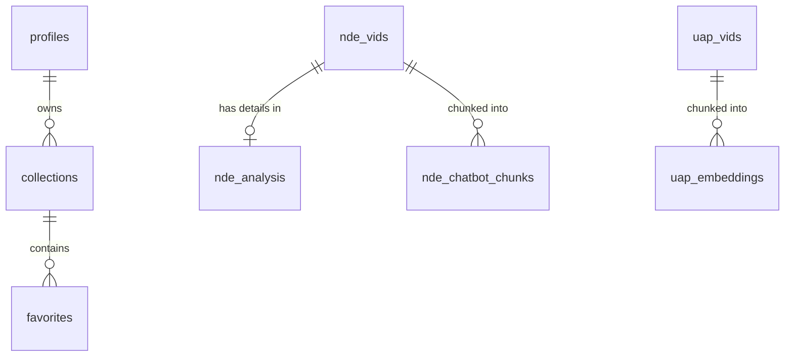

# Database Schema

> This document describes the database schema for Project Profound.
> Source of Truth: `src/lib/supabase/database.types.ts`

## Overview
The database is hosted on Supabase (PostgreSQL). It stores NDE (Near-Death Experience) accounts, analysis data, chat logs, user profiles, and more.

## Tables

### `collections`
**Purpose:** Stores user-created collections of videos.

| Column | Type | Nullable | Description |
|---|---|---|---|
| id | number | NO | Primary Key |
| user_id | string | NO | Owner of the collection |
| name | string | NO | Collection name |
| description | string | YES | Optional description |
| created_at | string | YES | Timestamp |

**Relationships:**
- None explicitly defined in types, but `user_id` links to `auth.users`.

---

### `favorites`
**Purpose:** Stores user favorites (videos added to collections).

| Column | Type | Nullable | Description |
|---|---|---|---|
| id | number | NO | Primary Key |
| user_id | string | NO | User ID |
| video_id | string | NO | Video ID |
| collection_id | number | NO | Foreign Key to `collections.id` |
| note | string | YES | Optional note (field `content` in types) |
| start_time | number | YES | Optional start time bookmark |
| created_at | string | YES | Timestamp |
| video_title | string | YES | Cached title |
| video_thumbnail_url | string | YES | Cached thumbnail |

**Relationships:**
- `collection_id` → `collections.id`

---

### `n8n_chat_histories`
**Purpose:** Stores chat history for n8n workflows.

| Column | Type | Nullable | Description |
|---|---|---|---|
| id | number | NO | Primary Key |
| session_id | string | NO | Session identifier |
| message | Json | NO | The message object |

---

### `nde_analysis`
**Purpose:** Stores detailed analysis of NDE videos.

| Column | Type | Nullable | Description |
|---|---|---|---|
| video_id | string | NO | Foreign Key to `nde_vids.videoId` |
| analysis_report_html | string | YES | HTML report |
| cleaned_transcript | string | YES | Cleaned text |
| greyson_breakdown | Json | YES | Greyson scale data |
| intensity_level | string | YES | Calculated intensity |
| meets_cutoff_criteria | boolean | YES | Filter flag |
| meets_nde_criteria | boolean | YES | NDE confirmation |
| nde_c_breakdown | Json | YES | NDE-C scale data |
| primary_phenomenology | string | YES | Main phenomenology |
| scale_agreement | string | YES | Agreement metric |
| total_greyson_score | number | YES | Score |
| total_nde_c_score | number | YES | Score |

**Relationships:**
- `video_id` → `nde_vids.videoId` (One-to-One)

---

### `nde_chat_logs`
**Purpose:** Logs chat interactions between users and the AI.

| Column | Type | Nullable | Description |
|---|---|---|---|
| id | number | NO | Primary Key |
| session_id | string | NO | Session ID |
| sender | string | NO | 'user' or 'bot' |
| message | string | YES | Message content |
| chat_page | string | YES | Which chat interface |
| metadata | Json | YES | Extra data |
| created_at | string | NO | Timestamp |

---

### `nde_chatbot_chunks`
**Purpose:** Stores text chunks and embeddings for RAG (Retrieval Augmented Generation).

| Column | Type | Nullable | Description |
|---|---|---|---|
| id | number | NO | Primary Key |
| video_id | string | YES | Foreign Key to `nde_vids.videoId` |
| content | string | YES | Text content |
| embedding | string | YES | Vector embedding |
| metadata | Json | YES | Chunk metadata |

**Relationships:**
- `video_id` → `nde_vids.videoId`

---

### `nde_punctuated_embeddings`
**Purpose:** Stores embeddings for punctuated subtitles.

| Column | Type | Nullable | Description |
|---|---|---|---|
| id | number | NO | Primary Key |
| video_id | string | YES | Video ID |
| content | string | YES | Text content |
| embedding | string | YES | Vector embedding |
| start_time | number | YES | Timestamp in video |

---

### `nde_vids`
**Purpose:** Main table for NDE video data (metadata + analysis summaries).

| Column | Type | Nullable | Description |
|---|---|---|---|
| videoId | string | NO | Primary Key (YouTube ID) |
| title | string | YES | Video title |
| description | string | YES | Video description |
| channelId | string | YES | YouTube Channel ID |
| channelName | string | YES | Channel Name |
| viewCount | number | YES | View count |
| likes | number | YES | Like count |
| commentsCount | number | YES | Comment count |
| duration | string | YES | Duration string |
| date | string | YES | Published date |
| isNde | enum | YES | Status: `clear_nde`, `possible_nde`, `not_nde`, `insufficient_info` |
| subtitles | string | YES | Raw subtitles |
| subtitles_cleaned | string | YES | Cleaned subtitles |
| subtitles_embedding | string | YES | Full text embedding |
| subtitles_punctuated | string | YES | Punctuated text |
| raw_timestamped_subtitles | Json | YES | Raw JSON subtitles |
| nde_analysis_html | string | YES | Analysis HTML |
| ... | ... | ... | (Many other analysis columns) |

---

### `nps_feedback`
**Purpose:** Stores user feedback/NPS scores.

| Column | Type | Nullable | Description |
|---|---|---|---|
| id | string | NO | Primary Key |
| score | number | NO | 0-10 score |
| feedback | string | YES | Text feedback |
| path | string | YES | URL path where feedback was given |
| country_code | string | YES | User location |
| created_at | string | NO | Timestamp |

---

### `precog_trials`
**Purpose:** Unknown / Experimental table for precognition trials?

| Column | Type | Nullable | Description |
|---|---|---|---|
| id | string | NO | Primary Key |
| experiment_id | string | YES | Experiment ID |
| prompt_text | string | YES | Prompt used |
| ai_guess | string | YES | AI prediction |
| actual_result | string | YES | Actual outcome |
| is_correct | boolean | YES | Result |

---

### `profiles`
**Purpose:** User profiles extending Supabase Auth.

| Column | Type | Nullable | Description |
|---|---|---|---|
| id | string | NO | Primary Key (matches `auth.users.id`) |
| full_name | string | YES | Display name |
| avatar_url | string | YES | Profile picture |
| role | string | NO | User role (`user`, `admin`, `super_admin`) |
| is_banned | boolean | YES | Ban status |

---

### `saved_searches`
**Purpose:** Stores users' saved search queries.

| Column | Type | Nullable | Description |
|---|---|---|---|
| id | number | NO | Primary Key |
| user_id | string | NO | User ID |
| search_term | string | NO | The query |
| search_name | string | YES | Custom name |
| search_type | string | NO | Type of search |
| sort_by | string | NO | Sort field |
| sort_direction | string | NO | `asc` or `desc` |
| created_at | string | YES | Timestamp |

---

### `search_logs`
**Purpose:** Logs all searches performed on the site for analytics.

| Column | Type | Nullable | Description |
|---|---|---|---|
| id | number | NO | Primary Key |
| search_term | string | YES | Query |
| search_type | string | YES | Type |
| results_count | number | YES | How many results found |
| created_at | string | NO | Timestamp |

---

### `uap_embeddings`
**Purpose:** Embeddings for UAP (Unidentified Anomalous Phenomena) videos.

| Column | Type | Nullable | Description |
|---|---|---|---|
| id | number | NO | Primary Key |
| video_id | string | YES | Foreign Key to `uap_vids.video_id` |
| content | string | YES | Text content |
| embedding | string | YES | Vector embedding |

**Relationships:**
- `video_id` → `uap_vids.video_id`

---

### `uap_vids`
**Purpose:** Metadata for UAP videos (parallel to `nde_vids`).

| Column | Type | Nullable | Description |
|---|---|---|---|
| video_id | string | NO | Primary Key |
| title | string | YES | Video title |
| description | string | YES | Description |
| timestamped_embedding_status | string | NO | Processing status |
| ... | ... | ... | ... |

## Views

### `clear_nde_with_names`
**Purpose:** A simplified view of `nde_vids` filtered for "clear" NDEs, including simplified columns.

